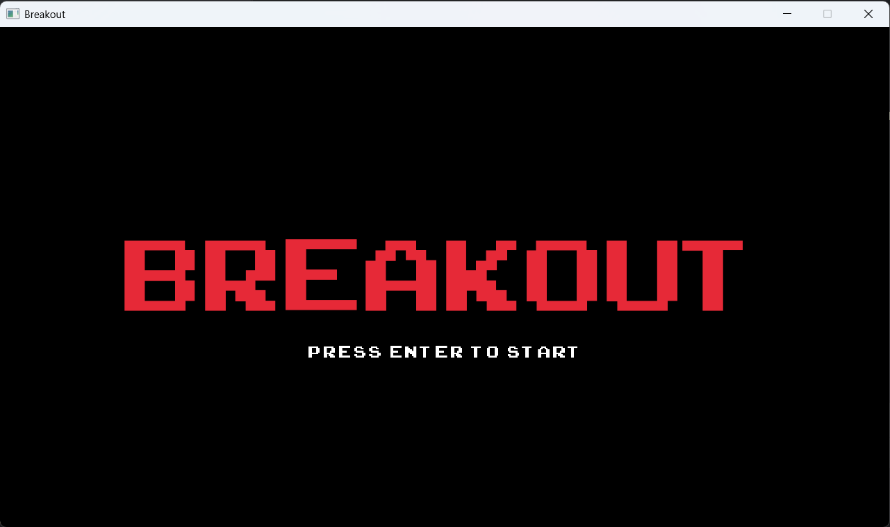
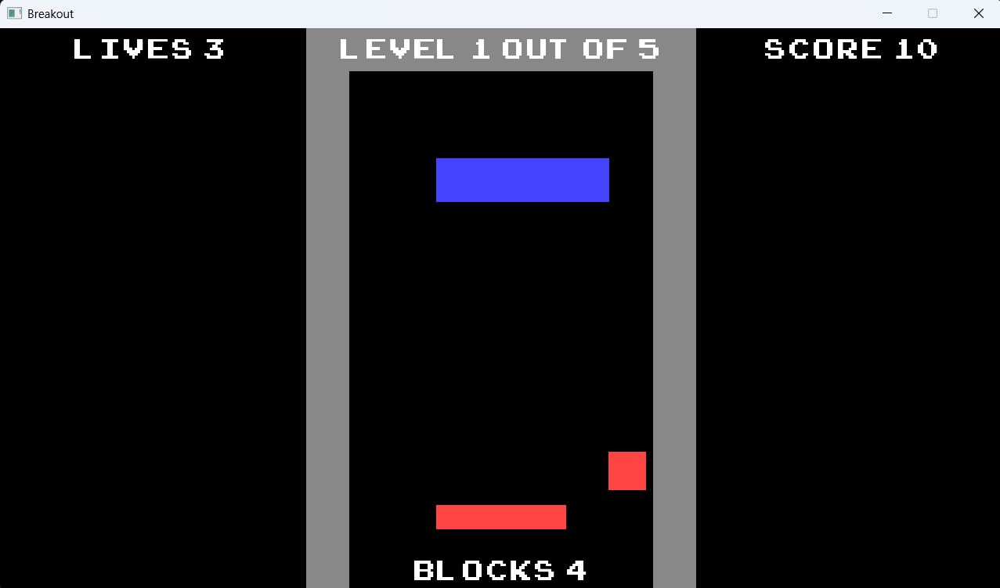
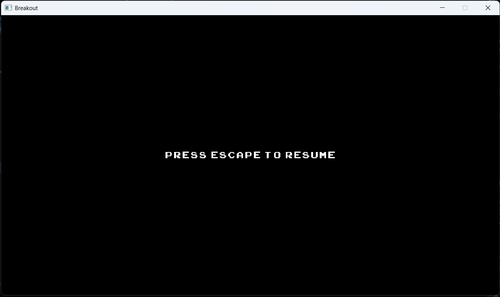
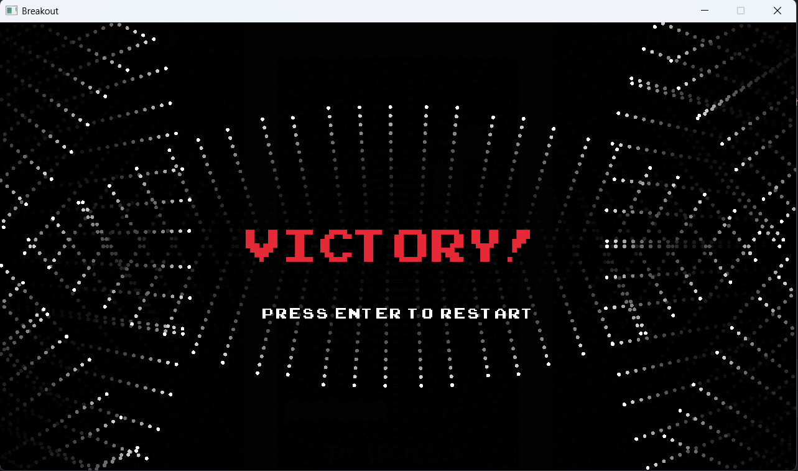
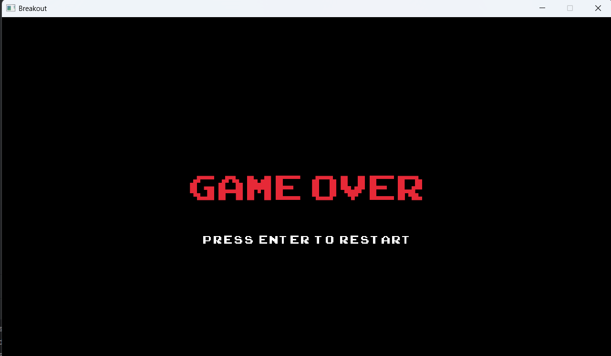

# Simple Breakout Game

## Description

This is a classic Breakout arcade game made in C++ using the raylib library. The player controls a paddle at the bottom of the screen to bounce a ball and destroy all blocks on each level. The goal is to complete all 5 levels without losing all lives.

## Features Implemented

### Core Requirements
- **Menu Screen** - Start screen with game title and "Press Enter to Start" message



- **Game Screen** - Main gameplay with paddle, ball, blocks, and UI



- **Pause Screen** - Press ESC to pause/resume the game



- **Victory Screen** - Congratulations screen with animated balls when all levels completed



- **Game Over Screen** - Screen shown when player runs out of lives



### Additional Features
- **5 Levels** - Added 3 extra levels (levels 3, 4, 5) with increasing difficulty
- **Lives System** - Player starts with 3 lives, loses one when ball falls
- **Score System** - Earn 10 points for each block destroyed
- **Ball Speed Increase** - Ball gets 10% faster with each level
- **Paddle Angle Control** - Ball bounces at different angles depending on where it hits the paddle
- **Background Music** - Looping background music that plays throughout the game
- **Sound Effects** - Multiple sounds for different actions:
  - Wall bounce sound
  - Block hit sound
  - Paddle bounce sound
  - Level completed sound
  - Life lost sound

### UI Elements
- Level counter
- Lives counter
- Score counter
- Blocks remaining counter

## Controls

- **Arrow Keys** or **A/D** - Move paddle left/right
- **ESC** - Pause/Resume game
- **Enter** - Start game from menu / Return to menu from game over/victory

## How to Play

1. Launch the game
2. Press Enter to start
3. Move the paddle to keep the ball in play
4. Destroy all blocks to advance to the next level
5. Complete all 5 levels to win
6. Don't let the ball fall, or you'll lose a life!

## Technical Details

- **Language**: C++
- **Graphics Library**: raylib 5.5
- **Development Environment**: CLion
- **Total Levels**: 5
- **Lives**: 3
- **Points per Block**: 10

## Project Structure

```
simple-breakout-project/
├── data/
│   ├── fonts/
│   ├── images/
│   └── sounds/
├── breakout.cpp
├── game.h
├── ball.h / ball.cpp
├── paddle.h / paddle.cpp
├── level.h / level.cpp
├── graphics.h / graphics.cpp
├── assets.h / assets.cpp
├── sprite.h / sprite.cpp
└── CMakeLists.txt
```

## Setup Instructions

1. Clone the repository
2. Open project in CLion
3. Set Working Directory to `$ProjectFileDir$` in Run Configuration
4. Build and run the project